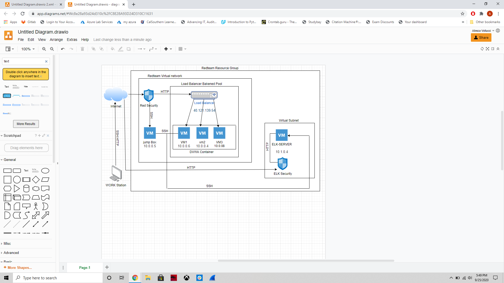
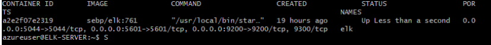

# project2020

The files in this repository were used to configure the network depicted below.

These files have been tested and used to generate a live ELK deployment on Azure. They can be used to either recreate the entire deployment pictured above. Alternatively, select portions of the .yml files may be used to install filebeat & metricbeat.

- [install-elk.yml](Scripts/install-elk.yml.txt)
- [filebeat-configuration.yml](Scripts/filebeat-configuration.yml.txt)
- [filebeat-playbook.yml](Scripts/filebeat-playbook.yml.txt)
- [metricbeat-configuration.yml](Scripts/metricbeat-configuration.yml.txt)
- [metricbeat-playbook.yml](Scripts/metricbeat-playbook.yml.txt)
- [pentest.yml](Scripts/pentest.yml.txt)

This document contains the following details:
- Description of the Topology
- Access Policies
- ELK Configuration
- Beats in Use
- Machines Being Monitored
- How to Use the Ansible Build

## Description of the Topology

The main purpose of this network is to expose a load-balanced and monitored instance of DVWA, the Damn Vulnerable Web Application.

Load balancing ensures that the application will be highly resilient, in addition to restricting access to the network.

The load balancer helps to ensure there is access to network resources is redundant.

Having access to the network limited to a single machine and a single IP.

Integrating an ELK server allows users to easily monitor the vulnerable VMs for changes to the system files and system logs.

Filebeat collects event log data and authenticates their integrity.

Metricbeat collects metrics on the system and services running on a server.

| Name     | Function | IP Address | Operating System  |
|----------|----------|------------|-------------------|
| Jump Box |Gateway   | 10.0.0.5   | Linux             |
| Web-1    |Web Server| 10.0.0.6   | Linux             |
| Web-2    |Web Server| 10.0.0.4   | Linux             |
| Web-3    |Web Server| 10.0.0.8   | Linux             |
| ELK      |Web Server| 10.1.0.4   | Linux             |

## Access Policies

The machines on the internal network are not exposed to the public Internet. 

Only the Jump Box machine can accept connections from the Internet. Access to this machine is only allowed from the following IP address:
- 52.255.145.652

Machines within the network can only be accessed by the Jump Box.

The ELK VM can only be accessed through the Ansible Container inside the Jump Box 10.0.0.4

A summary of the access policies in place can be found in the table below.

| Name     | Publicly Accessible | Allowed IP Addresses |
|----------|---------------------|----------------------|
|Jump Box  |   Yes               |     52.255.145.652   |
|Web-1     |   No                |     10.0.0.6         |
|Web-2     |   No                |     10.0.0.4         |
|Web-3     |   No                |     10.0.0.8         |
|ELK       |   No                |     10.1.0.4         |

## Elk Configuration

Ansible was used to automate the configuration of the ELK machine. No configuration was performed manually, which is advantageous because...

Using Ansible allows the quick deployment of applications without the need of writing custom code for each machine by instead writing a playbook that can be applied to all the machines.

The playbook implements the following tasks:
-  Docker.io
- Install pip3
- Install Docker python module
- Increase virtual memory
- use mem
- downloaded and launched a docker elk container

The following screenshot displays the result of running `docker ps` after successfully configuring the ELK instance.

## Target Machines & Beats
This ELK server is configured to monitor the following machines:
Web-1 10.0.0.16
Web-2 10.0.0.4
Web-3 10.0.0.6

We have installed the following Beats on these machines:
Filebeat
Metricbeat

These Beats allow us to collect the following information from each machine:

Filebeat collects event log data that can then be analyzed using Kibana and authenticates their integrity.
Metricbeat collects metrics on the system and services running on a server and can be analyzed using Kibana.

## Using the Playbook
In order to use the playbook, you will need to have an Ansible control node already configured. Assuming you have such a control node provisioned: 

SSH into the control node and follow the steps below:
- Copy the install-elk.yml file to /etc/ansible/files/
- Update the hosts file to include the IP addresses of the machines you want to run the playbooks on.
- Run the playbook, and navigate to Kibana to check that the installation worked as expected.

The DATA from this sent to the ELK can be analyzed by going to: http://13.91.36.238:5601/app/kibana

